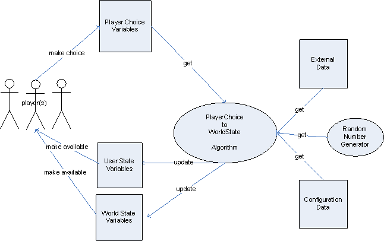

#SIMBUG Open Standard

##What a SIMBUG is
A SIMBUG is an acronym for a *Computerized Simulation Business Game*.
A SIMBUG is considered to have the following workflow:

##Entities

##Definition File

